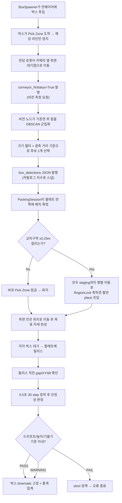
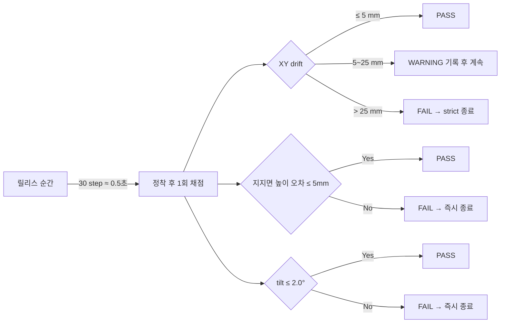

# 멀티 다관절로봇 기반 알고리즘 적용 팔레타이징 시스템

**두산로보틱스 H2017 다관절로봇 2대에 DeepPack3D 계열 팔레타이징 알고리즘을 적용하고, Isaac Sim 디지털 트윈 위에서 알고리즘 조합별 처리량·안정성·공간효율을 비교 검증하는 ROS 2 시스템**


---

## Overview

본 프로젝트는 **다관절로봇(Doosan H2017) 2대에 팔레타이징 알고리즘을 선택·적용해 성능을 비교하는** 것을 핵심 주제로, 팔레타이징 라인을 두 배로 늘렸을 때의 처리량·안정성·공간효율까지 함께 검증하는 디지털 트윈(Isaac Sim) 기반 Proof of Concept 시스템입니다.

* **알고리즘 적용/비교가 핵심**: DeepPack3D의 4종 휴리스틱(`BL`·`BAF`·`BSSF`·`BLSF`)과 확장 배치 정책(무게중심 반영 `default`/`stable`, 손목 자유도 `fixed`/`free`)을 CLI 옵션으로 선택 적용해, 같은 조건에서 다관절로봇 2대의 팔레타이징 성능을 비교합니다 (자세한 결과는 아래 "벤치마크 — 알고리즘 조합 검증" 섹션 참고).
* 실물 로봇 2대를 각각 컨베이어 1대에 전담 배정하고, 깊이 카메라로 박스 규격을 실시간 인식해 온라인으로 적재 위치를 결정합니다.
* 팔레트 1개를 두 로봇이 중앙선 기준으로 좌우 절반씩 나눠 채우기 때문에, 서로의 작업 영역이 겹치는 중앙 구간에서만 충돌 회피가 필요하고 나머지 구간에서는 완전히 병렬로 동작합니다.
* 적용할 알고리즘·정책, 박스 수량·호수, 투입 간격 등 실행 조건은 웹 대시보드에서 설정하고, 시뮬레이션 진행 로그·카메라 영상·3D 포인트클라우드를 같은 화면에서 실시간으로 확인하며, 종료 후에는 처리량·사이클타임·적재 안정성·공간효율 지표가 SQLite 이력 DB에 저장됩니다.

> 웹 UI(`system_monitor_ui`)가 실행 요청을 검증해 ROS 2 토픽으로 전달하면, Launcher 노드가 Isaac Sim(`H2017_integrated_V2_speedy_double`)을 별도 프로세스로 기동합니다. 시뮬레이션은 두 대의 외부 비전 노드(`conveyor_box_measurement_double`)에 깊이 영상을 발행해 박스 중심·크기·yaw를 되돌려받고, 선택된 DeepPack3D 알고리즘/정책 조합으로 팔레트 자리를 정한 뒤 로봇을 움직여 집고 쌓습니다. 릴리스 후에는 물리 안정성(드리프트·높이·기울기)을 검사해 PASS/WARNING/FAIL을 판정합니다.

본 시스템은 실제 물류센터 배치나 안전 인증을 목표로 하지 않으며, **다관절로봇 2대에 대한 팔레타이징 알고리즘 적용·비교 + 이중 로봇 협조 제어 + 비전 기반 규격 인식**을 하나의 워크플로우로 통합해 검증하는 시뮬레이션 데모입니다.

---

## 프로젝트 배경 및 가치

### 왜 이 프로젝트인가

* **핵심 문제**: 팔레타이징 알고리즘을 실제 로봇에 투입하기 전, 표준화된 검증 환경이 없어 도입 리스크와 비용이 큽니다.
* **시의성**: 국토교통부에 따르면 국내 물류산업의 기술 수준은 미국 대비 78.5%에 머물러 있으며, 정부는 로봇·자동화 중심 첨단화를 국가 전략으로 추진하고 있습니다(스마트물류센터 인증제, 물류AI기술 도입 지원사업, 2026년 로봇 배송·2027년 드론 배송 상용화를 목표로 한 스마트물류 인프라 구축방안 등).
* **우리의 가치**: Isaac Sim 기반 물리 시뮬레이션으로 실제 투입 전 알고리즘을 검증·비교함으로써, 도입 리스크와 비용을 낮추는 벤치마킹 플랫폼을 제공합니다 — *"실제 투입 전, 디지털 트윈에서 먼저 검증한다."*

### 프로젝트 차별점

* **범용성**: 비정형적이고 다양한 크기의 상자가 혼재된 환경에서도 팔레타이징 패턴을 생성해 다양한 물류 현장에 대응
* **확장성 및 하드웨어 이식**: 모듈화된 알고리즘 구조라 새 알고리즘을 도입해도 하드웨어 충돌이나 시스템 결합 없이 동작
* **실시간 고속 처리**: 컨베이어 벨트에 맞춰 실시간 의사결정을 내려 피크 시간대에도 정체 없이 처리
* **비전 기반 최적 배치 및 적재 안정성**: 비전으로 상자 크기·최적 중심점을 계산해 배치 효율을 극대화하고, 기존 알고리즘에 보완 로직을 추가해 구조적 안정성을 확보

### 시장 근거

* 글로벌 팔레타이징 로봇 시장은 CAGR 9.4%로 성장 중이며(출처: Fact.MR), 국내 스마트물류센터 인증도 2021년 도입 후 3년 만에 8배 이상(2024.11 기준 누적 51개소) 확산되었습니다.
* 두산로보틱스 사례 기준, 약 8,000만 원의 로봇 솔루션은 약 2.3년 시점에 연 3,500만 원 수준(연봉+4대보험 등)의 인건비를 역전합니다. 높은 초기 비용이 중소업체 진입을 막는 만큼, **저비용으로 먼저 검증할 수 있는 도구**의 필요성이 커지는 지점입니다.

---

## Design Notes — 프로세스 분리와 안전한 원격 실행

### 1. 세 프로세스 분리 (Python 버전 충돌 회피)

Isaac Sim은 번들 Python 3.11과 자체 ROS 2 Bridge를 쓰고, 비전 노드는 시스템 ROS 2 Humble의 Python 3.10 `rclpy`를 씁니다. 두 인터프리터가 같은 프로세스에서 인터페이스 확장 모듈을 공유할 수 없기 때문에, **Isaac Sim / 비전 노드 2개 / 웹 UI(Flask + Launcher)를 서로 다른 프로세스로 완전히 분리**하고 `std_msgs/String` JSON을 공용 언어로 사용해 ROS 2 토픽으로만 통신합니다. 커스텀 `.msg`를 만들지 않은 것도 같은 이유입니다.

### 2. 웹 서버는 실행 명령을 만들지 않는다 (Command Injection 방지)

대시보드에서 받은 설정은 Flask가 곧바로 셸 명령으로 만들지 않고, `/palletizing/control` 토픽에 **검증된 JSON**으로만 발행합니다. 실제로 Isaac Sim 프로세스를 `subprocess.Popen`으로 기동하는 것은 별도 프로세스인 `launcher.py`이며, 허용 목록에 있는 옵션만 argv로 변환합니다. 웹 서버가 임의의 셸 텍스트를 실행할 수 없는 구조로 막아 두어, 대시보드 입력값이 시스템을 오동작시킬 수 없습니다.

### 3. 왜 DeepPack3D인가

적용 알고리즘은 오픈소스 **DeepPack3D**가 제공하는 컨베이어 입고 순서대로 즉시 배치를 결정하는 **실시간 최적화** 방식입니다. 선택 이유는 세 가지입니다.

* **Multiple Heuristics**: `BL`·`BAF`·`BSSF`·`BLSF` 4종의 정석 팔레타이징 휴리스틱을 기본 제공해 표준 벤치마크 비교가 바로 가능
* **Open Source / Python**: 공개된 파이프라인을 그대로 적용할 수 있어 즉시 적용 가능
* **Extensible Structure**: 기본 알고리즘 위에 맞춤형 확장을 얹기 쉬운 구조

→ *즉시 적용 가능 → 비교 실험 가능 → 단계적 기능 확장 가능* 순으로, 기본 팔레타이징 알고리즘 위에 **매니퓰레이터 2대 협동 제어를 위한 확장 알고리즘**(작업영역 분할 + 교착 방지 인터락)을 얹었습니다.

### 4. 팔레타이징 + 최소 침습 협조

두 로봇은 각자 독립된 `PackingSession`으로 팔레트 반쪽을 중앙에서 바깥쪽으로 채우며, 평소에는 서로의 존재를 신경 쓰지 않고 완전히 병렬로 움직입니다(**Dual-Robot Partition**: 중앙선 기준 전용 영역 분리, **Parallel Scheduling**: 중앙선 기준 적재 우선). 계획된 배치가 중앙선 ±0.25 m 교차구역에 걸릴 때만 `RegionLock`(공유 구역 잠금, **Deadlock-Free Interlock**)을 얻어야 하고, 잠금을 얻지 못한 로봇은 병렬로 대기 위치까지 이동해 둔 채 기다립니다. 락 없는 완전 병렬 대신 이 방식을 택한 이유는, 팔레트 전체를 잠그면 처리량이 로봇 1대 수준으로 떨어지기 때문입니다. 교착 방지 원칙은 "조건 대기 중에는 자원을 점유하지 않는다"이며, 배치 조건을 먼저 확인하고 **실제 진입 직전에만** 중앙 구역 점유권을 획득해 잠금 구간을 최소화합니다(박스를 든 직후, 중앙 이탈 직후 즉시 반납).

각 로봇의 작업 흐름은 다음 6단계입니다.

1. 택배 박스 흡착 (그리퍼 흡착)
2. 안전 경로로 팔레트 접근
3. 지지 박스 완료 대기
4. (팔레트 중앙을 사용해야 하면) 중앙 공유구역 권한을 얻은 로봇만 진입
5. 박스 놓기 + 안정성 확인
6. (공유구역 점유권을 사용했다면) 공유구역을 빠져나오는 즉시 권한 반납

설계 효과는 매니퓰레이터 작업 영역 중첩 차단과 잠금 구간 최소화입니다.

### 5. 판정은 물리 기준, 완화가 아니라 원인 규명

적재 실패를 마찰·감쇠·질량 값을 올려서 가리지 않는다는 원칙을 코드/문서 양쪽에 명시하고 있습니다. XY 드리프트·지지 높이·기울기 기준을 초과하면 즉시 오류로 종료하며(`strict` 정책), 기준 완화 대신 로그로 원인(RMPflow 수렴성, 릴리스 오차, 지지 박스 접촉 등)을 추적하도록 설계되어 있습니다.

---

## Key Features

### Web Dashboard — 실행·모니터링·이력 (`system_monitor_ui`)

* `server.py`(Flask, `:5000`)가 `/smu`(실시간 대시보드)와 `/db`(이력 조회) 화면을 제공하고, 별도 스레드에서 `rclpy.spin()`으로 ROS 2 브리지를 겸함 (`rclpy` 미검출 시 ROS 기능만 비활성화되고 웹 화면은 계속 동작)
* `launcher.py`가 `/palletizing/control` 요청을 받아 Isaac Sim 프로세스를 기동/종료하고, 진행 상태·로그·종료 결과를 토픽으로 되돌려 보냄
* C1/C2 비전 노드의 컬러 Depth 오버레이·검출 박스를 JPEG로, ROI/솟은 점군을 다운샘플된 바이너리로 웹에 스트리밍 (DEPTH / 3D POINTS 전환, SIDE/TOP/ISO 시점 전환)
* 실행 종료 시 투입·적재·제거 수, takt, 로봇별 cycle time, Pick Zone 지연, 비전 정확도, 안정성 PASS/WARNING, 공간효율을 SQLite(`palletizing_runs.db`)에 적재하고 `/db`에서 다시 조회

### Depth Vision — 박스 규격 인식 (`conveyor_box_measurement_double`)

* 컨베이어 정지 시 Depth 데이터로 박스의 3D 정보(**Center · Width · Length · Height · Yaw**)를 측정하는 `conveyor_box_measurement_node`가 컨베이어별로 독립 실행되며, 처리 흐름은 **Depth → 3D 복원 → 박스 검출 → 치수/자세 계산 → JSON 발행** 순입니다.
* 640×640 Depth를 핀홀 카메라 모델로 픽셀별 3D 점 `(x, y, z)`로 복원합니다 (`32FC1`은 m 단위 그대로, `16UC1`은 mm→m 변환, `NaN`/`Inf`는 0으로 정리, 이미지 ROI `x 510–770, y 145–480`만 사용).
* **RANSAC**으로 컨베이어 평면(inlier)을 제거해 박스 후보 점군만 남깁니다 (평면 판단 최대 거리 0.006 m, 최소 샘플 3점, 반복 1000회).
* 평면 위 점을 **DBSCAN**으로 군집화한 뒤, 크기 범위(footprint 0.12~0.50 m, 높이 0.05~0.35 m)로 레일·로봇 링크를 걸러내고 World 원점이 아닌 **카메라 광축 거리** 기준으로 가장 가까운 후보 하나를 선택합니다.
* 트리거 직후 빈 프레임을 받으면 최대 2프레임을 추가로 확인(`empty_detection_retry_frames`)한 뒤 `box_detections` JSON을 발행하고, 카메라 좌표를 TF로 World 좌표로 변환해 좌표계를 통일합니다.
* `sensor_msgs_py`, `cv_bridge`, Open3D 기반 디버그 영상/점군/마커를 5 Hz로 함께 발행해 RViz와 웹 UI가 그대로 재사용

### Isaac Sim Digital Twin — 이중 로봇 온라인 팔레타이징 (`H2017_integrated_V2_speedy_double`)

* `BoxSpawner` 2개가 카탈로그 1~4호 박스를 컨베이어에 투입하고, Pick Zone 도착 시 해당 라인만 정지 후 전담 로봇을 카메라 옆 대기점으로 이동
* `IntakeStation`이 비전 측정을 트리거하고, `DeepPack3D` 온라인 `PackingSession`이 검출 규격을 받아 그 자리에서 배치를 확정 (재계획 없음)
* `RegionLock` 기반 중앙 교차구역 협조 제어로 로봇 2대가 대부분 구간에서 병렬 동작, 릴리스 직전 자세 확인 → 0.5초(30 step) 정착 후 안정성 판정까지 자동 수행
* `--packing-method`(bl/baf/bssf/blsf), `--placer stable`(측면 지지·무게중심 여유 필터), `--yaw-rotation`, `--stability-policy` 등 CLI 옵션으로 알고리즘/정책 비교 실험 가능

### 3D Scene & Hardware

| 구성 | 내용 |
| --- | --- |
| Manipulators | Doosan **H2017** + OnRobot **VG10** 흡착 그리퍼 2대, 상면 흡착 방식으로 컨베이어 위 택배 상자를 파지 |
| Warehouse | 실제 물류 창고 환경을 기반으로 구성한 3D 씬 |
| Conveyor Belts | 랜덤 생성된 택배 상자가 벨트를 따라 이동, 목표 지점(Pick Zone) 도달 시 정지 → 알고리즘에 따라 파렛트에 자동 적재 |
| Camera | 컨베이어 상단에 배치, 이미지 토픽 발행, 택배 상자 치수·중심점 측정 |

**왜 VG10 상면 흡착인가**: ① 박스 윗면에 자유롭게 접근해 피킹·회전이 가능하고 ② 종이 상자의 찌그러짐·내용물 손상을 방지하며 ③ 박스 크기가 달라져도 상면 중앙 흡착이 항상 가능해, 택배 상자의 안정적인 파지와 팔레트 적재 공정에 가장 적합하다고 판단했습니다.

---

## System Architecture

```mermaid
flowchart LR
    User["사용자<br/>(브라우저)"]

    subgraph WebProc["Process A — Flask 웹 서버 (:5000)"]
        direction TB
        Server["server.py<br/>/smu · /db · REST API"]
        Bridge["system_monitor_ui_bridge<br/>rclpy.spin (별도 스레드)"]
    end

    subgraph LauncherProc["Process B — Launcher"]
        direction TB
        Launcher["launcher.py<br/>speedy_double_launcher"]
    end

    subgraph SimProc["Process C — Isaac Sim"]
        direction TB
        CamGraph["카메라 Action Graph x2<br/>cv1_depth / cv2_depth"]
        App["application.py<br/>IntakeStation · PackingSession<br/>RobotUnit · RegionLock"]
        RosBridge["ros_bridge.py<br/>palletizing_plan_publisher"]
    end

    subgraph VisionProc["Process D/E — Vision 노드 x2"]
        direction TB
        V1["conveyor_box_measurement_node<br/>(conveyor_1)"]
        V2["conveyor_box_measurement_node<br/>(conveyor_2)"]
    end

    RViz["RViz2<br/>(선택, 디버그용)"]

    User -->|"HTTP :5000"| Server
    Server <-->|"/palletizing/control<br/>/palletizing/process_state, log, result"| Bridge
    Bridge <-.->|"ROS 2 topics"| Launcher
    Launcher -->|"subprocess.Popen<br/>(허용 목록 argv만)"| SimProc

    CamGraph -->|"/cv1_depth, /cv2_depth<br/>/cv_camera{1,2}_info"| V1
    CamGraph --> V2
    RosBridge -->|"/conveyor_{1,2}/status"| V1
    RosBridge --> V2
    V1 -->|"/vision/conveyor_1/box_detections"| RosBridge
    V2 -->|"/vision/conveyor_2/box_detections"| RosBridge
    RosBridge --> App

    V1 -->|"/vision/conveyor_N/debug/*<br/>overlay · pointcloud · markers"| Bridge
    V2 --> Bridge
    V1 -.-> RViz
    V2 -.-> RViz

    classDef user fill:#fff7ed,stroke:#f97316,stroke-width:1px,color:#111827;
    classDef web fill:#eff6ff,stroke:#2563eb,stroke-width:1px,color:#111827;
    classDef launcher fill:#f5f3ff,stroke:#7c3aed,stroke-width:1px,color:#111827;
    classDef sim fill:#ecfdf5,stroke:#059669,stroke-width:1px,color:#111827;
    classDef vision fill:#fef2f2,stroke:#dc2626,stroke-width:1px,color:#111827;
    classDef rviz fill:#f9fafb,stroke:#6b7280,stroke-width:1px,color:#111827;

    class User user;
    class Server,Bridge web;
    class Launcher launcher;
    class CamGraph,App,RosBridge sim;
    class V1,V2 vision;
    class RViz rviz;
```



### 온라인 팔레타이징 처리 순서



### 안정성 판정 기준



### 서브시스템 구성

| Subsystem | 주요 구성 | 역할 |
| --- | --- | --- |
| Web Dashboard | `system_monitor_ui` (`server.py`, `launcher.py`) | 실행 설정/시작·정지, 실시간 로그·영상·점군 스트리밍, 이력 DB |
| Depth Vision | `conveyor_box_measurement_double` (`node.py` x2) | 컨베이어별 박스 중심·크기·yaw 측정, 디버그 영상/점군/마커 발행 |
| Isaac Sim Digital Twin | `H2017_integrated_V2_speedy_double` (`src/h2017_palletizing/*`) | 로봇 2대 온라인 팔레타이징, DeepPack3D 배치, 안정성 판정 |
| Documentation | `docs/POAIPHS_*.drawio`, 각 패키지 `docs/` | 시스템/노드/기능 흐름도, 아키텍처·기술 상태·트러블슈팅 기록 |

전체 데이터 흐름: `Web Dashboard(실행 요청)` → `Launcher(Isaac Sim 기동)` → `Isaac Sim ↔ Vision 노드 x2(측정 요청/응답)` → `Isaac Sim(배치·파지·적재·안정성 판정)` → `Web Dashboard(진행 로그·영상·점군·이력 표시)`

---

## Repository Structure

```text
cobot_Ws/
├── README.md                              # 실행 가이드 (본 파일의 축약/실전 버전)
├── README_origin.md                       # 프로젝트 개요·아키텍처 문서 (본 파일)
├── docs/
│   ├── POAIPHS_system_architecture.drawio      # 시스템 구성 중간 상세도
│   ├── POAIPHS_functional_flowchart.drawio      # 기능 흐름 블록도 (F1.0~F7.0)
│   └── POAIPHS_node_architecture.drawio         # ROS 2 노드/토픽 그래프
└── src/
    ├── system_monitor_ui/                  # 웹 대시보드 (ament_python)
    │   ├── system_monitor_ui/server.py     #   Flask 앱 + ROS2 브리지 (entry: server)
    │   ├── system_monitor_ui/launcher.py   #   Isaac Sim 프로세스 기동/종료 (entry: launcher)
    │   ├── system_monitor_ui/db.py         #   SQLite 실행 이력
    │   └── templates/{smu,db}.html         #   실시간 대시보드 / 이력 화면
    ├── conveyor_box_measurement_double/    # 깊이 카메라 박스 측정 (ament_python)
    │   ├── src/conveyor_box_measurement/   #   패키지명은 conveyor_box_measurement
    │   ├── config/measurement_conveyor_{1,2}.yaml
    │   ├── run_double_vision.sh            #   C1/C2 노드 동시 실행 스크립트
    │   └── test/test_pipeline.py
    └── H2017_integrated_V2_speedy_double/  # Isaac Sim 시뮬레이션 (ROS 패키지 아님)
        ├── scripts/test5_2robot.py         #   Isaac Sim 진입점
        ├── src/h2017_palletizing/
        │   ├── application.py              #   부팅·온라인 배정·두 로봇 병렬 루프
        │   ├── intake.py                   #   비전 측정 상태기계·재시도
        │   ├── planning.py                 #   DeepPack3D 온라인 배치
        │   ├── robot.py                    #   로봇 상태기계·파지/릴리스
        │   ├── stability.py                #   릴리스·정착 안정성 판정
        │   ├── coordination.py             #   RegionLock, 유휴 로봇 순위
        │   ├── scene.py / conveyor.py       #   장면·박스 물리, 컨베이어/Pick Zone
        │   └── ros_bridge.py               #   Isaac Sim 내부 단일 ROS 노드
        ├── config/rmpflow/, vision_debug.rviz
        ├── docs/architecture.md, engineering_notes.md, test5_run_guide.md, packing_algorithms.md
        ├── outputs/palletizing_plan.json, rmpflow/
        └── tests/                          #   Isaac Sim 없이 도는 순수 로직 테스트
```

### 실제 빌드 워크스페이스 구성

이 저장소(`cobot_Ws`)는 그 자체로 `src/`가 곧 colcon 워크스페이스의 `src` 디렉터리 역할을 합니다. 하위 README들은 이 디렉터리를 `SPEEDY_DOUBLE_ROOT`(저장소 루트)로 부릅니다.

```text
~/cobot_Ws/                          (= SPEEDY_DOUBLE_ROOT)
├── build/ install/ log/             # colcon 빌드 산출물
└── src/
    ├── system_monitor_ui/                  # colcon 패키지
    ├── conveyor_box_measurement_double/     # colcon 패키지 (패키지명 conveyor_box_measurement)
    └── H2017_integrated_V2_speedy_double/   # colcon 패키지 아님, Isaac Sim 전용 Python 프로젝트
```

### ROS 2 패키지

| 패키지 | 빌드 타입 | 역할 |
| --- | --- | --- |
| `system_monitor_ui` | `ament_python` | Launcher/Server 노드, 웹 대시보드(Flask), SQLite 이력 |
| `conveyor_box_measurement` (디렉터리명 `conveyor_box_measurement_double`) | `ament_python` | C1/C2 깊이 카메라 박스 측정 노드 |
| `H2017_integrated_V2_speedy_double` | 없음 (`package.xml` 없음) | Isaac Sim 팔레타이징 프로젝트, `test5_2robot.py`를 Isaac Sim Python으로 직접 실행 |

---

## Custom Interfaces / API

### ROS 2 Topics — 웹 대시보드 ↔ Launcher

| 토픽 | 방향 | 타입 | 설명 |
| --- | --- | --- | --- |
| `/palletizing/control` | UI → Launcher | `std_msgs/String` (JSON) | 시작/정지 요청, 허용 목록으로 검증된 설정만 포함 |
| `/palletizing/process_state` | Launcher → UI | `std_msgs/String` (JSON, RELIABLE+TRANSIENT_LOCAL) | 실행 상태, 1초 주기 발행 |
| `/palletizing/log` | Launcher → UI | `std_msgs/String` (stdout 라인 스트림, depth 100) | 진행 로그 |
| `/palletizing/result` | Launcher → UI | `std_msgs/String` (JSON, RELIABLE+TRANSIENT_LOCAL) | 종료 시 1회 발행되는 최종 지표 |

### ROS 2 Topics — Isaac Sim ↔ Vision 노드

| 토픽 | 타입 | 발행 | 구독 | 설명 |
| --- | --- | --- | --- | --- |
| `/cv1_depth`, `/cv2_depth` | `sensor_msgs/Image` | Isaac 카메라 Action Graph | C1/C2 비전 노드 | 라인별 깊이 영상 |
| `/cv_camera1_info`, `/cv_camera2_info` | `sensor_msgs/CameraInfo` | Isaac 카메라 Action Graph | C1/C2 비전 노드 | 카메라 내부 파라미터 |
| `/tf_static` | `tf2_msgs/TFMessage` | Isaac 카메라 Action Graph | 비전 노드, RViz | 카메라 좌표계 |
| `/conveyor_1/status`, `/conveyor_2/status` | `std_msgs/Bool` | Isaac 브리지 (`ros_bridge.py`) | C1/C2 비전 노드 | 라인별 비전 측정 트리거 |
| `/vision/conveyor_1/box_detections`, `/vision/conveyor_2/box_detections` | `std_msgs/String` (JSON) | C1/C2 비전 노드 | Isaac 브리지 | 박스 중심·크기·yaw (`box: null` 가능) |
| `/palletizing/plan` | `std_msgs/String` (JSON) | Isaac 브리지 | 모니터링 도구 | 누적 팔레타이징 계획 |

### ROS 2 Topics — 비전 디버그 (RViz / 웹 UI 공용)

| 토픽 | 타입 | 설명 |
| --- | --- | --- |
| `/vision/conveyor_N/debug/overlay_image` | `sensor_msgs/Image` (`bgr8`) | 컬러 Depth + ROI + 검출 박스/치수 오버레이 |
| `/vision/conveyor_N/debug/depth_image` | `sensor_msgs/Image` (`32FC1`) | 미터 단위 원본 Depth |
| `/vision/conveyor_N/debug/pointcloud` | `sensor_msgs/PointCloud2` | 핀홀 모델 역투영 ROI 점군 |
| `/vision/conveyor_N/debug/raised_points` | `sensor_msgs/PointCloud2` | 컨베이어 기준면보다 솟은 점군 |
| `/vision/conveyor_N/debug/markers` | `visualization_msgs/MarkerArray` | 기준면·3D 박스·중심점·치수 텍스트 |

> QoS: `/vision/conveyor_N/debug/*`는 sensor 프로파일 `BEST_EFFORT`, `/palletizing/process_state`·`/palletizing/result`는 `RELIABLE + TRANSIENT_LOCAL`(늦게 붙는 구독자도 마지막 값을 즉시 수신)로 구분되어 있습니다.

### REST API — 웹 대시보드 (Flask, `system_monitor_ui/server.py`)

| Method | 경로 | 사용 화면 | 설명 |
| --- | --- | --- | --- |
| GET | `/smu` | SMU-01 | 실행 제어 화면 렌더링 |
| GET | `/db` | DB-01 | 실행 기록 화면 렌더링 |
| GET | `/api/state` | SMU-01 | 프로세스 상태·로그·비전·종료 결과 전체 스냅샷 조회 (0.7초 폴링) |
| POST | `/api/control` | SMU-01 | 시작/종료 명령 → ROS 2 `/palletizing/control` 토픽 발행. 미연결 시 `503` |
| GET | `/api/vision/{1,2}/frame.jpg` | SMU-01 | Depth 오버레이 JPEG. 데이터 없으면 `204` |
| GET | `/api/vision/{1,2}/cloud.bin` | SMU-01 | 포인트클라우드 XYZ 바이너리. `kind=roi`(최대 5000점) 또는 `raised`(최대 3500점) |
| GET | `/api/runs` | DB-01 | 실행 기록 목록 조회 (limit 기본 100, 최대 500) |
| GET | `/api/runs/{id}` | DB-01 | 단일 실행 기록 상세 조회 |
| DELETE | `/api/runs/{id}` | DB-01 | 단일 실행 기록 삭제 |
| DELETE | `/api/runs` | DB-01 | 전체 실행 기록 삭제 |

> 실행 결과가 `/palletizing/result` 토픽으로 수신되면 서버가 자동으로 `executions` 테이블에 저장하므로, DB-01(이력 화면)에는 별도의 저장 API가 없습니다.

### 종료 지표 (SQLite 저장)

투입·적재·제거 수, 시스템 takt, 처리량, 로봇별 cycle time, Pick Zone 지연, 비전 검출·분류 정확도, 안정성 PASS/WARNING과 drift, 공간효율을 실행 종료 시 `palletizing_runs.db`에 적재합니다. 공간효율은 바닥 점유율(`F`)과 수직 압축률(`C`)의 조화평균에 안정성 통과율(`S`)을 곱해 계산합니다.

```text
공간효율 = (2 * F * C / (F + C)) * S * 100
```

---

## UI 화면 구성 (SMU-01 실행 제어 화면)

`/smu` 실시간 대시보드는 아래 15개 요소로 구성됩니다.

| No. | 명칭 | 유형 | 설명 |
| ---: | --- | --- | --- |
| 1 | ROS Launcher 연결 상태 | 상태 표시 | Launcher 온라인 여부를 pill로 표시, 3.5초 이상 heartbeat 미수신 시 오프라인 처리 |
| 2 | 실행 기록 이동 링크 | 링크 | DB-01(실행 기록 화면)으로 이동 |
| 3 | 실행 설정 입력 폼 | 입력 그룹 | 박스 수/호수, 시드, 스폰 간격, 비전 안정화 step, `ROS_DOMAIN_ID`, 휴리스틱(bl·baf·bssf·blsf), Placer, 안정성 정책, 최소 측면 지지율, 최소 COM margin — 총 11개 필드 |
| 4 | 실행 옵션 체크박스 | 체크박스 | 안정성 PASS 후 고정 / 90° yaw 허용 / 안정성 tie-break / 중심 적층 후보 / Headless 실행 (5종) |
| 5 | 시뮬레이션 시작 | 버튼 | 설정값 검증 후 Isaac Sim 프로세스 기동. ROS 미연결 또는 실행 중이면 비활성화 |
| 6 | 정상 종료 | 버튼 | 실행 중인 프로세스에 `SIGINT` 전달. 비실행 중이면 비활성화 |
| 7 | 실행 커맨드 미리보기 | 텍스트 | 입력값 변경 시 실제 실행될 커맨드를 참고용으로 표시 (서버 전송 없음, 클라이언트 로컬 처리) |
| 8 | 프로세스 상태 카드 | 상태 표시 | 상태(idle/starting/running/stopping/completed/failed/stopped), PID, 실행 시간(초), Run ID(앞 12자) |
| 9 | C1 Depth Vision 카드 | 복합 뷰 | 1번 컨베이어 인식 결과, 상단에 LIVE/OFFLINE 상태(2.5초 이상 미수신 시 OFFLINE) |
| 10 | DEPTH / 3D POINTS 전환 | 탭 버튼 | DEPTH: ROS `bgr8` 오버레이를 JPEG로 변환한 영상 / 3D POINTS: 인터랙티브 포인트클라우드 |
| 11 | 시점 프리셋 | 버튼 | SIDE / TOP / ISO 시점 전환. 드래그 회전, 휠 확대·축소, 더블클릭 시점 초기화 지원 |
| 12 | 측정 치수 표시 | 텍스트 | 검출된 박스의 `L × W × H`를 mm 단위로 표시, 하단에 BOX ID·yaw(rad)·ROI/융기 포인트 수 |
| 13 | C2 Depth Vision 카드 | 복합 뷰 | 2번 컨베이어 인식 결과. 구성은 9~12와 동일하며 C1과 완전히 독립 동작 |
| 14 | 실행 로그 콘솔 | 로그 뷰 | Launcher가 발행한 stdout 로그를 시간순으로 표시(최대 300줄), 새 Run 시작 시 초기화 |
| 15 | 종료 지표 패널 | 지표 카드 | 실행 완료 시에만 노출. 종료 상태, 적재/제거, 물리 시간, 시스템 takt, 처리량, 평균 cycle, 비전 정확도, 안정성 PASS/WARNING, 평균 drift, 공간효율 (12종) |

`/db`(DB-01) 화면은 SQLite에 저장된 실행 기록을 목록·상세 조회하는 이력 화면입니다.

---

## Prerequisites

### 하드웨어 (시뮬레이션 실행 기준)

* NVIDIA Isaac Sim 실행이 가능한 GPU/워크스테이션
* (실물 검증 시) Doosan H2017 로봇 2대 + OnRobot VG10 상면 흡착 그리퍼, 컨베이어 2계열, 깊이 카메라 2대
* 시뮬레이션(Isaac Sim)과 비전 노드를 별도 PC로 나눠 실행할 수 있으며(PC1/PC2), 같은 ROS 2 DDS 네트워크에만 있으면 됩니다

### 소프트웨어 요구사항

* Ubuntu 22.04 LTS, ROS 2 Humble
* NVIDIA Isaac Sim (번들 Python 3.11, `ISAAC_SIM_PYTHON` 환경변수로 경로 지정)
* Python 3.10 (시스템 ROS 2 Humble 측), Flask, Pillow, NumPy, OpenCV, Open3D
* ROS 패키지: `rclpy`, `sensor_msgs`, `sensor_msgs_py`, `visualization_msgs`, `std_msgs`, `cv_bridge`, `tf2_ros_py`, `ament_index_python`

### Python 의존성

```bash
# system_monitor_ui
pip install --user flask Pillow

# conveyor_box_measurement_double
pip install --user numpy opencv-python open3d
```

> `rosdep`가 배포판에서 `python3-open3d`를 설치하지 못하면 `python3 -m pip install open3d`로 시스템 Python에 직접 설치합니다.

---

## Build

```bash
export SPEEDY_DOUBLE_ROOT="$HOME/cobot_Ws"   # 저장소 경로는 환경에 맞게 변경
cd "$SPEEDY_DOUBLE_ROOT"
source /opt/ros/humble/setup.bash

rosdep install \
  --from-paths src/system_monitor_ui src/conveyor_box_measurement_double \
  --ignore-src -r -y

colcon build --symlink-install \
  --packages-select system_monitor_ui conveyor_box_measurement

source install/setup.bash
```

`H2017_integrated_V2_speedy_double`은 `package.xml`이 없는 순수 Isaac Sim Python 프로젝트라 colcon 빌드 대상이 아니며, `ISAAC_SIM_PYTHON`(Isaac Sim 설치 디렉터리의 `python.sh`)으로 직접 실행합니다.

```bash
find ~ -maxdepth 6 -iname "python.sh" 2>/dev/null   # Isaac Sim python.sh 경로를 모를 때
```

세 프로세스(웹 UI, Launcher, 비전 노드, Isaac Sim)는 모두 같은 `ROS_DOMAIN_ID`와 RMW 구현을 사용해야 서로를 발견합니다. 이 프로젝트의 기본값은 `ROS_DOMAIN_ID=129`, `rmw_fastrtps_cpp`입니다.

---

## Run

권장 실행 순서는 **Launcher → 웹 UI → 비전 노드**이며, 비전 노드는 Isaac Sim의 Depth 토픽이 나오기 전부터 켜 두어도 됩니다. 아래 명령은 저장소 루트(`cobot_Ws`)에서 각각 새 터미널을 열고 실행합니다.

### 1. Launcher

```bash
export SPEEDY_DOUBLE_ROOT="$HOME/cobot_Ws"
source /opt/ros/humble/setup.bash
source "$SPEEDY_DOUBLE_ROOT/install/setup.bash"
export ROS_DOMAIN_ID=129
export RMW_IMPLEMENTATION=rmw_fastrtps_cpp
export ISAAC_SIM_PYTHON="<Isaac Sim 설치 디렉터리>/python.sh"
export SPEEDY_DOUBLE_PROJECT="$SPEEDY_DOUBLE_ROOT/src/H2017_integrated_V2_speedy_double"

ros2 run system_monitor_ui launcher
```

Launcher는 Isaac Sim을 직접 실행하지 않고 대기하다가, 웹 UI에서 **시뮬레이션 시작**을 누르면 `H2017_integrated_V2_speedy_double/scripts/test5_2robot.py`를 Isaac Sim Python으로 실행합니다.

### 2. 웹 UI Server

```bash
export SPEEDY_DOUBLE_ROOT="$HOME/cobot_Ws"
source /opt/ros/humble/setup.bash
source "$SPEEDY_DOUBLE_ROOT/install/setup.bash"
export ROS_DOMAIN_ID=129
export RMW_IMPLEMENTATION=rmw_fastrtps_cpp

ros2 run system_monitor_ui server
```

브라우저에서 `http://localhost:5000/smu`를 열고 실행 조건(적재 알고리즘, 박스 수량 등)을 설정한 뒤 **시뮬레이션 시작**을 누릅니다. 이력 화면은 `http://localhost:5000/db`입니다.

### 3. Depth Vision 노드 (C1/C2)

```bash
export SPEEDY_DOUBLE_ROOT="$HOME/cobot_Ws"
source /opt/ros/humble/setup.bash
source "$SPEEDY_DOUBLE_ROOT/install/setup.bash"
export ROS_DOMAIN_ID=129
export RMW_IMPLEMENTATION=rmw_fastrtps_cpp

cd "$SPEEDY_DOUBLE_ROOT/src/conveyor_box_measurement_double"
./run_double_vision.sh
```

이 스크립트는 `conveyor_1_measurement`, `conveyor_2_measurement` 두 노드를 동시에 실행합니다. **두 번 실행하지 않습니다** — 라인별 Publisher가 중복되어 검출 결과와 디버그 데이터도 중복 발행될 수 있습니다.

### (선택) RViz에서 비전 디버그 확인

```bash
export SPEEDY_DOUBLE_ROOT="$HOME/cobot_Ws"
source /opt/ros/humble/setup.bash
export ROS_DOMAIN_ID=129
export RMW_IMPLEMENTATION=rmw_fastrtps_cpp

rviz2 -d "$SPEEDY_DOUBLE_ROOT/src/H2017_integrated_V2_speedy_double/config/vision_debug.rviz"
```

### (선택) Launcher/웹 UI 없이 Isaac Sim만 직접 실행

```bash
export SPEEDY_DOUBLE_ROOT="$HOME/cobot_Ws"
export ROS_DOMAIN_ID=129
export RMW_IMPLEMENTATION=rmw_fastrtps_cpp
export ISAAC_SIM_PYTHON="<Isaac Sim 설치 디렉터리>/python.sh"

cd "$SPEEDY_DOUBLE_ROOT/src/H2017_integrated_V2_speedy_double"
"$ISAAC_SIM_PYTHON" scripts/test5_2robot.py --box-count 2 --seed 42
```

### 주요 시뮬레이션 옵션

| 옵션 | 기본값 | 설명 |
| --- | ---: | --- |
| `--box-count N` | 25 | 투입할 박스 수 (2단 적재 회귀 검증은 짝수 권장) |
| `--box-numbers RANGE` | `1-4` | 스폰할 카탈로그 호수 |
| `--seed N` | 랜덤 | 재현 가능한 박스 순서·색상 |
| `--packing-method` | `baf` | `bl` / `baf` / `bssf` / `blsf` |
| `--placer` | `default` | `default` / `stable`(측면 지지·무게중심 여유 필터 추가) |
| `--yaw-rotation` | 꺼짐 | 로봇별 90°/-90° yaw 정렬 후 place |
| `--stability-policy` | `strict` | `strict` / drift만 계속 진행하는 `continue-drift` |
| `--headless` | 꺼짐 | GUI 없이 실행 |

### 종료

각 터미널에서 `Ctrl+C`로 종료합니다. 권장 순서는 **비전 노드 → 웹 UI → Launcher**이며, Launcher를 `Ctrl+C`로 종료하면 Launcher가 시작한 Isaac Sim에도 `SIGINT`가 전달됩니다.

```bash
pgrep -af 'test5_2robot.py|conveyor_box_measurement.node|rviz2|isaacsim.exp.base.python.kit'
```

---

## Verification / 최근 검증 상태

검증일 2026-08-11, `ROS_DOMAIN_ID=129`, `rmw_fastrtps_cpp` 기준입니다.

| 조건 | 결과 |
| --- | --- |
| 순수 로직 단위 테스트 | 시뮬레이터 `128 passed`, 비전 `8 passed` |
| `--box-count 2 --seed 42` (스모크) | 검출·분류 `2/2`, 적재 안정성 `2/2 PASS` |
| `--box-count 5 --seed 42` | 검출·분류 `5/5`, 적재 안정성 `5/5 PASS`, 물리 경과 46.3초 |
| `--box-count 6 --seed 42` | 검출·분류 `6/6`, 6번째 2단 박스 릴리스까지 성공 (정착 후 XY drift 7.4~7.6 mm, WARNING) |
| 컨베이어 `1.2 m/s` GUI 스모크 | 양 라인 Pick Zone 오버슈트 없이 `2/2 PASS`, 전체 물리 경과 24.4초 → 22.3초 |
| RMP target P gain `35 → 45` 튜닝 후 | 로봇 사이클 9.90/12.10초, 전체 물리 경과 22.3초 → 18.3초, 적재 안정성 `2/2 PASS` |

### 테스트 실행

```bash
# Isaac Sim이 필요 없는 시뮬레이터 순수 로직 테스트
cd "$SPEEDY_DOUBLE_ROOT/src/H2017_integrated_V2_speedy_double"
env PYTHONPATH=src PYTEST_DISABLE_PLUGIN_AUTOLOAD=1 python3 -m pytest -q

# 비전 패키지 테스트
source /opt/ros/humble/setup.bash
cd "$SPEEDY_DOUBLE_ROOT/src"
env PYTHONPATH=conveyor_box_measurement_double/src \
  PYTEST_DISABLE_PLUGIN_AUTOLOAD=1 python3 -m pytest -q -p no:anyio \
  conveyor_box_measurement_double/test
```

---

## 벤치마크 — 알고리즘 조합 검증

동일 조건에서 최적 조합을 찾기 위해 4종 박스 카탈로그(1~4호, 크기별 발생 확률 차등) × 고정 시드 5개(`7 / 13 / 21 / 29 / 37`) × 적재 휴리스틱 4종(`BL`,`BAF`,`BSSF`,`BLSF`) × 무게중심 반영 여부 2종(`default` vs `stable`) × 6축 관절 모드 2종(`fixed` vs `free`)를 조합해 **총 675개 요청 박스, 200런 규모**로 반복 비교했습니다. 지표는 **알고리즘 → 물리 안정성 → 로봇 실행(wrist)** 3단계로 순차 검증합니다.

* **STEP 1 (알고리즘 성능)**: 적재율·체적효율은 `BSSF` / `BL`이 최고
* **STEP 2 (물리 안정성)**: `stable` placer는 적재량 대신 안정성(지지율↑ · tilt↓)에서 우위
* **STEP 3 (로봇 실행, wrist fixed vs free)**: 4휴리스틱 × 2 placer × 5시드 × 2모드 = 80런, 40페어 A/B 비교

| 지표 | wrist = fixed | wrist = free |
| --- | ---: | ---: |
| 적재율 | 90.10% | 86.67% |
| 1 사이클 평균 시간 | 8.02 s | 9.51 s |
| 전도 건수 | 7건 | 9건 |

40페어 중 `free` 우세 1 / 동률 36 / 열세 3 — `fixed` 대비 총 완료 수 17개 감소, 평균 택트 1.49초 느림, 전도/연쇄 런 2건 많음. **단기 시연 및 현재 설정에서는 `fixed` 권장.**

### 종합 결론 — 적재량 최고 ≠ 실전 최적

| 단계 | 항목 | 최종 선택 | 근거 |
| --- | --- | --- | --- |
| STEP 1 | 알고리즘 | `bssf` | 적재율·체적효율 최고 |
| STEP 2 | 무게중심 반영 | `stable` | 지지율↑ · tilt↓ |
| STEP 3 | 6축 관절 모드 | `fixed` | 적재율↑ · 택트↓ · 전도↓ |

**최종 권장 조합: `--packing-method bssf --placer stable` + wrist fixed(기본값)**

> `H2017_integrated_V2_speedy_double/docs/engineering_notes.md`에 기록된 현재 코드 기본값은 `--packing-method baf`이며, 위 대규모 스윕 결과로 찾은 권장값(`bssf` + `stable`)은 아직 기본값으로 승격되지 않았습니다 (Roadmap 참고).

---

## Key Issues & Resolutions

> 아래는 `docs/architecture.md`, `docs/engineering_notes.md`, 코드 주석에서 실제로 확인한 이슈/원인/해결 내역입니다.

| 이슈 | 원인 | 해결 |
| --- | --- | --- |
| 격자 배치 부동소수점 경계 오류 | `0.28 / 0.01`이 `28.000000000000004`로 계산되어 높이를 29칸으로 올림 → 같은 4호 위 박스가 지지면보다 10 mm 뜸 | 정확한 배수에 수치 오차 tolerance를 적용해 28칸으로 고정, 팔레트 가용 폭 `floor` 계산도 동일하게 보정 |
| Pick Zone 근처 로봇 링크가 박스로 오검출 | 후보 선택을 World 원점 거리 기준으로 수행 | 카메라 좌표의 **광축 거리** 기준으로 후보를 선택하도록 변경 |
| 트리거 직후 빈 Depth 프레임으로 오탐 | 측정 트리거 직후 과거(빈) 프레임이 들어올 수 있음 | 비전 노드가 최대 2프레임, `IntakeStation`이 null 결과를 최대 2회 추가 요청 |
| 팔레트 중앙 교차구역 충돌 위험 | 두 로봇이 각자 팔레트 반쪽을 채우지만 중앙선 부근은 겹칠 수 있음 | 중앙선 ±0.25 m를 `pallet_center` 교차구역으로 두고 `RegionLock` 획득한 팔만 place 진입, 탈출 즉시 반납 |
| 저높이 보정 등 릴리스 보정 옵션의 실효성 부족 | 저높이 보정, Z feed-forward, adaptive settle, 재흡착 복구 등을 시도했으나 효과 미미 | 계획 지지면 위 6 mm 목표, 고정 30 step 정착 후 1회 채점하는 단일 경로로 단순화 |
| Isaac Sim(Python 3.11)과 시스템 ROS 2 Humble(Python 3.10) 인터페이스 모듈 비호환 | 커스텀 `.msg`/`.srv`의 Python 확장 모듈을 서로 다른 인터프리터가 import 불가 | 커스텀 메시지 대신 `std_msgs/String` JSON을 프로세스 간 공용 포맷으로 사용 |
| RANSAC 평면 오인식으로 인한 높이 계산 오류 | 컨베이어 기준면 검출이 흔들려 박스 높이가 잘못 계산되는 경우 발생 | Depth 값의 85 백분위수 기반 방식으로 교체해 안정화 |
| 로봇 진동 및 관절 토크 과다 | RMPflow 목표 추종 게인이 초기값 130으로 과도해 진동·토크 문제 발생 | 게인을 35로 낮춰 우선 안정화한 뒤, 이후 속도 튜닝 과정에서 35 → 45로 재상향(Verification 표 참고) |
| 고속 컨베이어 후보 속도에서 장기 수렴 실패 | 고속 후보(4.5, 4.0 rad/s) 관절 속도 적용 시 RMPflow가 장시간 수렴하지 못하는 현상 발생 | 안정성이 검증된 REAL-BASE 속도(3.927 rad/s)로 확정 |

### 알려진 비차단(non-blocking) 경고

* 시스템 SciPy 1.8이 요구하는 NumPy `<1.25`와 실제 설치된 NumPy 1.26.4 간 버전 경고가 시작 시 발생하지만 현재 실행·테스트는 통과합니다.
* Isaac Sim의 RealSense rigid-body pattern, deprecated extension, `CameraInfo` 왜곡 모델 경고는 Depth/CameraInfo 발행과 비전 검증을 막지 않습니다.
* `XMLPARSER realpath failed` 메시지는 ROS 2 프로세스 시작 시 보이지만 DDS 연결·토픽 통신에는 영향이 없습니다.

---

## Roadmap / TODO

### 기술 세부 항목 (`docs/engineering_notes.md` "남은 작업 우선순위" 기준)

* [ ] 2단 박스 릴리스 직전 XY 오차(약 8 mm)가 현재 릴리스 기준(15 mm)은 통과하지만 안정성 기준과 어떻게 정합시킬지 별도 시뮬레이션으로 검증
* [ ] 릴리스 기준을 5 mm로 낮추기 전에 RMPflow 수렴 가능성과 실제 미끄러짐 원인(릴리스 오차/지지 박스 접촉/마찰)을 구분해 확인
* [ ] J2 peak torque가 정격 경계(`372.07~372.13 / 372 Nm`)에 근접 — 실제 하드웨어 적용 전 payload·토크 여유 검증 필요
* [ ] 여러 `--seed`에서 2단 적재 drift와 관절 peak/RMS를 수집해 단일 seed 결론 회피
* [ ] 시스템 SciPy/NumPy 버전 정렬 (현재는 경고만 발생, 장기적으로 의존성 정리 필요)
* [ ] 벤치마크에서 확인한 권장 조합(`--packing-method bssf --placer stable`, wrist fixed)을 코드 기본값(`baf`)으로 승격할지, 처리량과의 트레이드오프 추가 검증

### 시스템 확장 방향 (최종 발표 자체 평가 기준)

* [ ] **센서 노이즈 강인성 검증**: 현재는 시뮬레이션 환경이라 검출·측정 결과가 이상적으로 높음 — 실제 하드웨어·다양한 노이즈 조건을 고려한 실측 기반 정확도 검증 및 알고리즘 보완 필요
* [ ] **AI 기반 비정규 규격 상자 분류 공정 추가**: 현재는 정해진 규격 상자를 전제로 하여 혼입되는 비정규·이형 상자의 예외 처리가 없음 — 객체 검출 비전 모델을 도입해 비정규 상자를 실시간 식별하고 별도 컨베이어로 이송하는 예외 처리 파이프라인 구축
* [ ] **실환경 동적 장애물 대응 확장**: 현재는 두 로봇을 상호 동적 장애물로 관리하고 RMPflow 회피 제어 + 공유 작업 영역 인터락만 적용 — 작업자·외부 장애물을 실시간 검출해 RMPflow 장애물 위치로 실시간 갱신, 즉각 정지·회피 제어로 확장
* [ ] **상자별 가변 중량 물리 검증**: 현재는 모든 상자가 고정 밀도값을 갖는다는 전제라 물리 엔진에 정확히 반영되지 않음 — 상자별 가변 중량을 적용해 관절 토크 변화·그리퍼 파지 안정성 등 동역학적 거동을 검증
* [ ] **상자 사전 분류 전제의 한계 해소**: 현재 시나리오는 상자가 이미 분류된 상태를 전제로 진행 — 향후 상자 분류 기능까지 전체 시스템에 통합 필요

---

## Documentation

패키지별로 더 자세한 설계/실행 문서가 저장소 안에 이미 있습니다.

| 경로 | 내용 |
| --- | --- |
| `src/system_monitor_ui/README.md` | 웹 UI 토픽, 빌드/실행, Depth Vision 실시간 표시, 종료 지표·공간효율 계산식 |
| `src/conveyor_box_measurement_double/README.md` | 비전 노드 설치/실행, RViz Display 설정, 재시도 로직 |
| `src/H2017_integrated_V2_speedy_double/README.md` | 현재 검증 상태, 실행 명령, 코드 구조 |
| `src/H2017_integrated_V2_speedy_double/docs/architecture.md` | 프로세스 구성, 온라인 처리 순서, ROS 2 인터페이스, 모듈 경계 |
| `src/H2017_integrated_V2_speedy_double/docs/engineering_notes.md` | 물리/카탈로그 설정 근거, DeepPack3D 파라미터, 릴리스·안정성 기준, 남은 작업 |
| `src/H2017_integrated_V2_speedy_double/docs/test5_run_guide.md` | 통합 실행 명령, CLI 옵션 전체, 상태 점검, 테스트 실행 |
| `src/H2017_integrated_V2_speedy_double/docs/packing_algorithms.md` | 적재 알고리즘(baf/bssf 등) 및 `stable` 필터 근거 |
| `docs/POAIPHS_system_architecture.drawio` | 지능형 택배 허브 시스템 구성 중간 상세도 (사용자 접점/제어 서버/디지털 트윈) |
| `docs/POAIPHS_functional_flowchart.drawio` | 기능 흐름 블록도 (F1.0 실행 요청 ~ F7.0 파지·반송·적재) |
| `docs/POAIPHS_node_architecture.drawio` | ROS 2 노드/토픽 그래프 (프로세스 A~E 경계 포함) |

---

<div align="center">

본 프로젝트("멀티 다관절로봇 기반 알고리즘 적용 팔레타이징 시스템")는<br/>K-Digital Training · 두산로보틱스 지능형 로보틱스 엔지니어(ROKEY) 과정에서 수행되었습니다.

</div>
